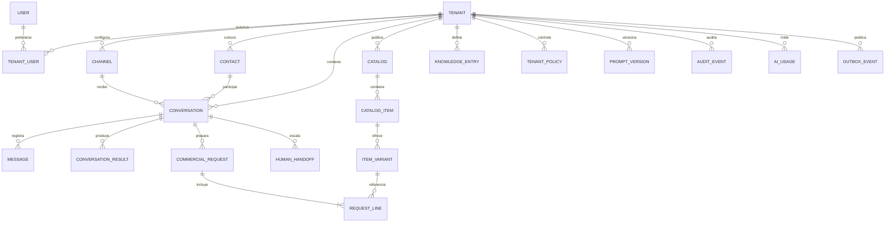

# Modelo conceptual de datos

## Objetivo

Definir una fuente de verdad multiempresa para conversaciones, conocimiento configurable y resultados comerciales. Su traducción física inicial, todavía no ejecutada, está en [../database/physical-schema.md](../database/physical-schema.md).

## Principios

- `tenant_id` identifica al propietario de todo dato de negocio.
- Las claves primarias principales usan UUIDv7 para conservar unicidad global y orden temporal aproximado.
- Las relaciones entre datos de tenant deben impedir referencias cruzadas entre empresas.
- Los nombres de Santos Tacos o de otro cliente no forman parte de tipos, estados ni reglas del núcleo.
- PostgreSQL conserva el estado durable; Redis solo podrá contener datos temporales, colas o caché reconstruible.
- Los mensajes recibidos y enviados son registros históricos; las correcciones generan nuevos eventos o versiones.
- Los secretos se guardan mediante referencias a un gestor seguro, no como texto legible en tablas de dominio.
- Datos flexibles en `jsonb` requieren esquema, validación y versión; no sustituyen entidades centrales.

## Vista de relaciones

## Identidad y acceso

### `tenant`

Empresa aislada dentro de la plataforma.

Campos conceptuales: `id`, `slug`, `display_name`, `status`, `timezone`, `default_locale`, `created_at`, `updated_at`.

`slug` es único globalmente. Desactivar un tenant bloquea procesamiento nuevo sin borrar su historial.

### `user`

Identidad de una persona que accede al panel. No representa al cliente final de WhatsApp.

Campos conceptuales: `id`, `email`, `name`, `status`, marcas de autenticación y tiempo.

### `tenant_user`

Membresía de un usuario en un tenant.

Campos conceptuales: `tenant_id`, `user_id`, `role`, `status`, `created_at`. La combinación de tenant y usuario es única. Los roles iniciales se definirán antes de implementar autenticación.

## Canal y clientes finales

### `channel`

Conexión de mensajería de un tenant. WhatsApp es el primer proveedor, sin fijar el modelo exclusivamente a él.

Campos conceptuales: `id`, `tenant_id`, `provider`, `external_account_id`, `external_address`, `status`, `secret_reference`, `configuration_version`, marcas de tiempo.

Debe existir una clave única adecuada para resolver un evento externo a un solo tenant. Los tokens nunca se guardan directamente en `secret_reference`.

### `contact`

Cliente final conocido por un tenant.

Campos conceptuales: `id`, `tenant_id`, `display_name`, `locale`, `timezone`, `consent_status`, `consent_at`, `last_interaction_at`, marcas de tiempo.

Una misma persona en dos comercios produce dos contactos independientes. No se crea un perfil global compartido en el MVP.

### `contact_identity`

Identificador del contacto dentro de un canal, por ejemplo un número normalizado o el identificador de WhatsApp.

Campos conceptuales: `id`, `tenant_id`, `contact_id`, `channel_id`, `provider_subject`, `normalized_address`, `verified_at`. Debe ser único dentro del canal y tenant.

## Conversaciones y mensajes

### `conversation`

Sesión de atención entre un contacto y un tenant.

Campos conceptuales: `id`, `tenant_id`, `channel_id`, `contact_id`, `status`, `current_intent`, `assigned_user_id`, `opened_at`, `last_message_at`, `closed_at`, `configuration_snapshot_id`.

Estados iniciales: `open`, `waiting_customer`, `waiting_human`, `closed`. El resultado comercial se registra aparte para no mezclar estado operativo y desenlace. El ciclo completo se define en [conversation-lifecycle.md](conversation-lifecycle.md).

### `message`

Evento de mensaje inmutable, entrante o saliente.

Campos conceptuales: `id`, `tenant_id`, `conversation_id`, `direction`, `sender_type`, `external_message_id`, `message_type`, `content`, `reply_to_message_id`, `delivery_status`, `occurred_at`, `received_at`, `created_at`.

`external_message_id` debe soportar idempotencia. El contenido multimedia se representa mediante metadatos y una referencia segura al objeto, no necesariamente como binario en PostgreSQL.

### `conversation_result`

Desenlace medible de una conversación.

Campos conceptuales: `id`, `tenant_id`, `conversation_id`, `result_type`, `source`, `recorded_at`, `metadata_schema`, `metadata`.

Tipos iniciales: `resolved`, `order_ready`, `qualified_opportunity`, `human_handoff`, `abandoned`, `failed`. Los resultados forman un historial append-only; al cerrar existe un único resultado final vigente.

## Catálogo y conocimiento

### `catalog`

Conjunto versionable de oferta comercial de un tenant.

Campos conceptuales: `id`, `tenant_id`, `name`, `status`, `currency`, `version`, `published_at`, marcas de tiempo.

### `catalog_item`

Producto o servicio genérico.

Campos conceptuales: `id`, `tenant_id`, `catalog_id`, `external_reference`, `name`, `description`, `status`, `category`, `attributes_schema`, `attributes`, marcas de tiempo.

### `item_variant`

Opción vendible o cotizable de un ítem.

Campos conceptuales: `id`, `tenant_id`, `catalog_item_id`, `sku`, `name`, `price_amount`, `currency`, `availability_status`, `availability_checked_at`, `attributes`, marcas de tiempo.

`availability_status` distingue al menos entre disponible, no disponible y desconocido. Desconocido nunca equivale a disponible.

### `knowledge_entry`

Información autorizada que no pertenece al catálogo: horarios, cobertura, preguntas frecuentes o instrucciones.

Campos conceptuales: `id`, `tenant_id`, `kind`, `title`, `content`, `status`, `valid_from`, `valid_until`, `source_reference`, `version`, marcas de tiempo.

### `tenant_policy`

Regla configurable para confirmación, escalamiento, privacidad o comportamiento comercial.

Campos conceptuales: `id`, `tenant_id`, `policy_type`, `schema_version`, `configuration`, `status`, `effective_from`, marcas de tiempo.

### `prompt_version`

Versión auditable de una plantilla combinable con configuración del tenant.

Campos conceptuales: `id`, `tenant_id`, `purpose`, `version`, `template_reference`, `model_configuration`, `status`, `published_at`. Debe ser posible conocer la versión usada en una respuesta, sin guardar secretos en la plantilla.

## Solicitudes comerciales

### `commercial_request`

Representa una acción comercial en preparación: pedido, cotización, reserva u oportunidad. Evita que el núcleo dependa del concepto restaurante.

Campos conceptuales: `id`, `tenant_id`, `conversation_id`, `contact_id`, `request_type`, `status`, `currency`, `subtotal_amount`, `total_amount`, `fulfillment_type`, `customer_notes`, `confirmed_at`, `expires_at`, marcas de tiempo.

Estados iniciales: `draft`, `awaiting_confirmation`, `ready`, `cancelled`, `expired`. `ready` significa listo para el proceso operativo configurado, no pagado ni aceptado por un sistema externo.

### `request_line`

Elemento de una solicitud comercial.

Campos conceptuales: `id`, `tenant_id`, `commercial_request_id`, `item_variant_id`, `description_snapshot`, `unit_price_snapshot`, `quantity`, `attributes_snapshot`, `line_total`.

Los snapshots preservan lo que el cliente confirmó aunque el catálogo cambie después. Todos los importes usan decimal o unidades monetarias enteras; nunca punto flotante.

## Operación, auditoría y costo

### `human_handoff`

Transferencia a una persona.

Campos conceptuales: `id`, `tenant_id`, `conversation_id`, `reason`, `priority`, `summary`, `suggested_next_action`, `status`, `assigned_user_id`, `requested_at`, `accepted_at`, `resolved_at`.

### `audit_event`

Registro append-only de acciones sensibles y cambios relevantes.

Campos conceptuales: `id`, `tenant_id`, `actor_type`, `actor_id`, `action`, `subject_type`, `subject_id`, `correlation_id`, `occurred_at`, `metadata`.

No debe almacenar tokens, contenido sensible innecesario ni cadenas completas de razonamiento del modelo.

### `ai_usage`

Medición por operación de IA.

Campos conceptuales: `id`, `tenant_id`, `conversation_id`, `message_id`, `provider`, `model`, `purpose`, tokens de entrada y salida, `estimated_cost`, `currency`, `latency_ms`, `success`, `occurred_at`.

### `ai_response_policy`, `ai_budget_period` y `ai_usage_reservation`

La política controla activación, rollout determinístico, solicitudes diarias y presupuesto mensual por tenant. Los períodos mantienen contadores diarios y mensuales; una reserva aparta capacidad atómicamente antes de contactar al proveedor y se liquida como completada o fallida al registrar `ai_usage`.

Las nuevas empresas comienzan con IA desactivada. El código no contiene excepciones para Santos Tacos ni para ningún tipo de comercio.

### `processing_event`

Control de idempotencia y diagnóstico de webhooks o trabajos.

Campos conceptuales: `id`, `tenant_id`, `source`, `external_event_id`, `correlation_id`, `status`, `attempt_count`, `received_at`, `processed_at`, `last_error_code`. La carga original requiere una política de retención específica.

### `outbox_event`

Intención durable de ejecutar un efecto asíncrono después de confirmar una transacción de negocio.

Campos conceptuales: `id` UUIDv7, `tenant_id`, `event_type`, `aggregate_type`, `aggregate_id`, `correlation_id`, `payload_schema_version`, `payload`, `status`, `attempt_count`, `available_at`, `created_at`, `published_at`, `last_error_code`.

Se crea en la misma transacción que el cambio que origina el evento. Un publicador lo entrega a BullMQ y marca su avance de forma reintentable. La entrega es al menos una vez; todos los consumidores deben deduplicar por `id` y aplicar efectos idempotentes.

## Reglas de aislamiento

- Toda tabla de dominio incluye `tenant_id`, incluso cuando puede inferirse por una relación.
- Las claves foráneas de datos multiempresa deben incluir `tenant_id` o contar con una restricción equivalente que impida cruces.
- NestJS obtiene el tenant desde el canal autenticado o la sesión autorizada; no confía en un `tenant_id` libre enviado por el cliente.
- Los repositorios y servicios aplican el contexto del tenant por defecto.
- Row-Level Security se activa desde la primera migración como segunda barrera, no como sustituto del control de aplicación.
- La aplicación opera con un rol sujeto a RLS; migraciones y tareas administrativas usan roles separados y restringidos.
- Colas, cachés, logs, almacenamiento de archivos y métricas también incorporan el tenant en claves y etiquetas.
- Las pruebas automáticas deben intentar lecturas y escrituras cruzadas entre al menos dos tenants.

## Índices y restricciones a validar

- Resolución única del canal por proveedor y dirección externa.
- Identidad de contacto única por tenant y canal.
- Idempotencia de mensaje y evento externo.
- Búsqueda de conversaciones por tenant, estado y actividad reciente.
- Búsqueda de catálogo vigente y disponibilidad por tenant.
- Solicitudes por tenant, estado y fecha.
- Auditoría y consumo por tenant y rango de tiempo.
- Eventos outbox pendientes por `status` y `available_at`, con recuperación segura entre workers.
- Restricciones de moneda coherente entre catálogo, variante, solicitud y líneas.

Los nombres, restricciones e índices iniciales se concretaron en el diseño físico. Retención, almacenamiento multimedia y posibles optimizaciones como particionamiento siguen pendientes de medición.

## Privacidad y retención pendientes

- Base legal y registro de consentimiento para contacto y memoria comercial.
- Plazos distintos para mensajes, archivos multimedia, auditoría y eventos técnicos.
- Anonimización o eliminación solicitada por el titular.
- Acceso del soporte de plataforma a datos de un tenant.
- Cifrado de campos sensibles y estrategia de respaldos.
- Uso de conversaciones anonimizadas para evaluación de prompts.

## Decisiones antes de implementar

1. Definir retención, consentimiento y borrado.
2. Establecer moneda predeterminada y excepciones de precisión monetaria.
3. Fijar umbrales de reintento, lease y retención de eventos outbox.
4. Definir valores de temporizadores para el ciclo conversacional.
5. Elegir almacenamiento de multimedia y proveedor de secretos.

UUIDv7 y Row-Level Security desde la primera migración fueron aprobados y ya no se consideran decisiones pendientes.
El límite transaccional entre NestJS y n8n fue definido en [nestjs-n8n-boundary.md](nestjs-n8n-boundary.md); sus contratos técnicos aún deben detallarse.
Transactional outbox desde la primera migración fue aprobado; resta precisar su operación y retención.
El ciclo conversacional y el historial de resultados fueron definidos en [conversation-lifecycle.md](conversation-lifecycle.md).
