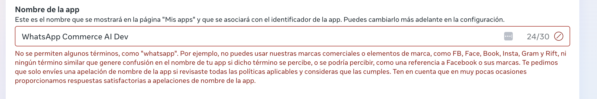
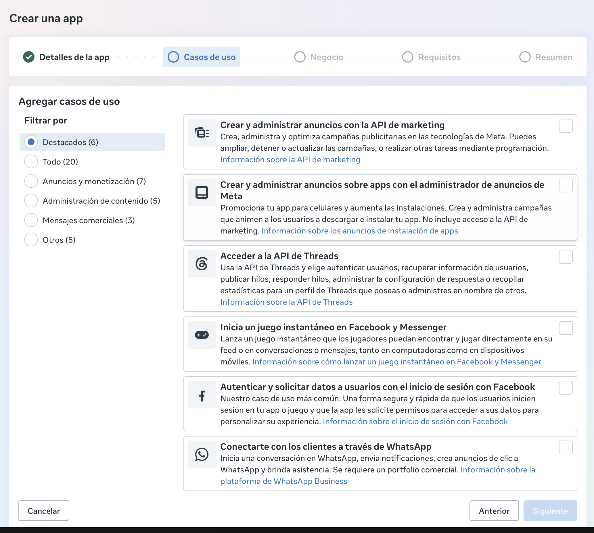
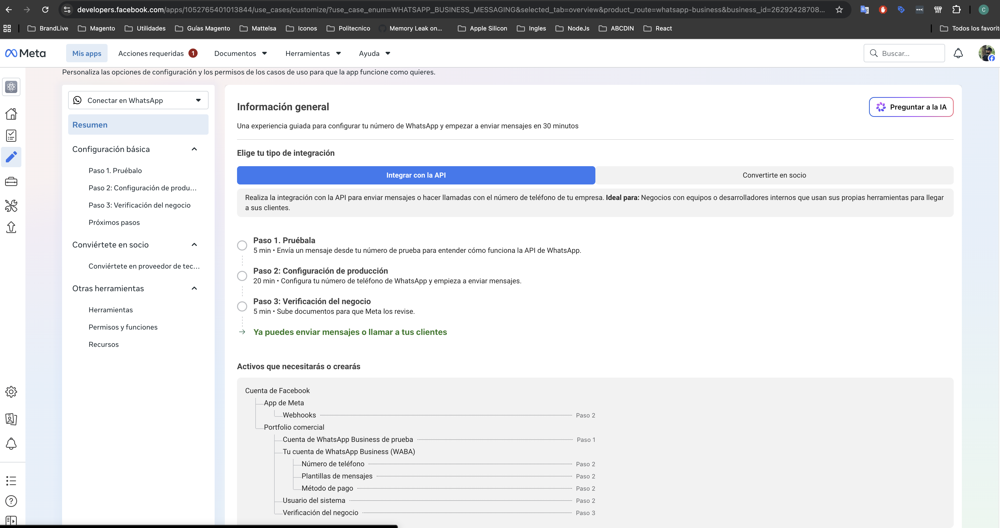
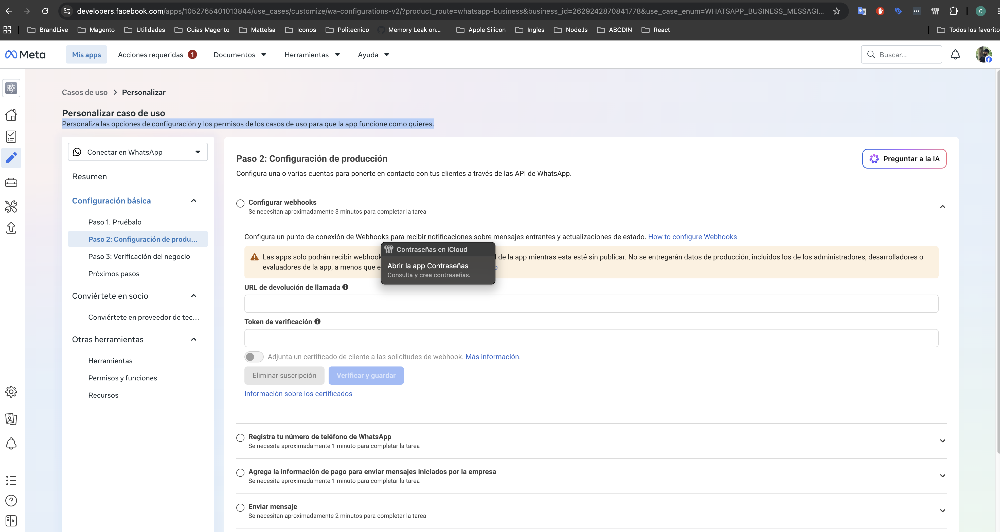
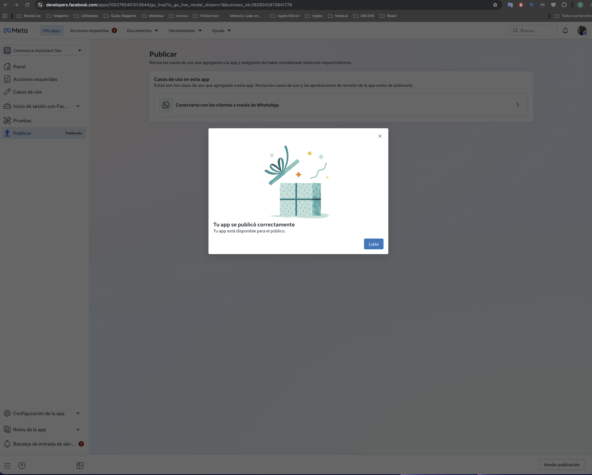

# Configuración visual de la aplicación de Meta

Esta guía reproduce el alta validada con `Commerce Assistant Dev`. Las capturas
seleccionadas excluyen correos, teléfonos personales, tokens, App Secret y cargas
de webhook con datos de contactos.

## 1. Crear la aplicación

Crear una app vinculada al portafolio comercial correspondiente. Meta no permite
usar `WhatsApp` en el nombre de la aplicación; usar un nombre propio como
`Commerce Assistant Dev`.



## 2. Elegir el caso de uso

Seleccionar **Conectarte con los clientes a través de WhatsApp**. No agregar
Facebook Login, Marketing API u otros permisos si el producto no los necesita.



## 3. Elegir integración por API

En **Personalizar**, elegir **Integrar con la API**. El paso 1 crea un número de
prueba y permite autorizar un destinatario de prueba. El access token mostrado
allí es secreto y temporal.



## 4. Preparar el backend y el webhook

El backend necesita valores distintos para cada propósito:

```dotenv
WHATSAPP_WEBHOOK_VERIFY_TOKEN=generado-por-nosotros
WHATSAPP_APP_SECRET=clave-secreta-de-la-app-meta
WHATSAPP_ACCESS_TOKEN=token-de-acceso-meta
```

- `VERIFY_TOKEN`: confirma el challenge `GET`.
- `APP_SECRET`: valida la firma HMAC de cada `POST`.
- `ACCESS_TOKEN`: autoriza llamadas salientes a Graph API.

Exponer temporalmente el backend:

```bash
ngrok http 3000
```

Registrar como callback:

```text
https://HOST/v1/webhooks/whatsapp
```



Suscribir únicamente el campo `messages`. Además, la app debe estar suscrita al
WABA mediante `/{WABA_ID}/subscribed_apps`; configurar la URL no sustituye esta
suscripción.

## 5. Configurar privacidad y publicar

Meta requiere una política de privacidad pública. `/privacy` es temporal para
pruebas mediante ngrok; producción requiere dominio estable, contacto formal y
una política revisada.

Publicar la app solo después de revisar que los permisos necesarios sean:

- `whatsapp_business_management`
- `whatsapp_business_messaging`



## 6. Prueba de aceptación

1. Enviar un texto desde el destinatario autorizado al número de prueba.
2. Confirmar `POST /v1/webhooks/whatsapp` con HTTP 200.
3. Crear una solicitud saliente desde la conversación real.
4. Confirmar `wamid` y estados `sent`, `delivered`, `read`.
5. Revisar outbox, BullMQ y métricas.

## Manejo de capturas y secretos

Nunca documentar ni compartir access tokens, App Secret, Verify Token, números
personales, `wa_id`, cuerpos de conversaciones ni códigos de verificación. Los
Phone Number ID, WABA ID y App ID son identificadores, pero también se deben
ocultar en material público cuando no sean necesarios.
